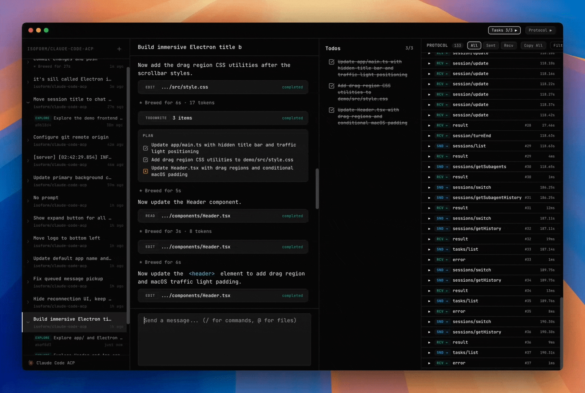

# Dev Studio

[](https://www.npmjs.com/package/@zed-industries/claude-code-acp)



A full-featured app built on [Claude Code](https://www.anthropic.com/claude-code) and the [Agent Client Protocol](https://agentclientprotocol.com/). Extends the official [Claude Agent SDK](https://platform.claude.com/docs/en/agent-sdk/overview) with a rich web UI, an Electron desktop app, and an ACP adapter layer that any compatible client can plug into.

## Features

- **Context @-mentions** -- reference files, symbols, and URLs inline
- **Images** -- attach and reason over screenshots and diagrams
- **Tool calls** -- run tools with granular permission requests
- **Following** -- real-time streaming of agent activity
- **Edit review** -- inspect proposed file changes before applying
- **TODO lists** -- track and manage tasks within a session
- **Terminals** -- interactive and background shell sessions
- **Slash commands** -- custom [slash commands](https://docs.anthropic.com/en/docs/claude-code/slash-commands) for reusable workflows
- **Client MCP servers** -- extend capabilities with additional MCP servers

## Quick Start

This project extends the [Agent Client Protocol](https://agentclientprotocol.com/) with additional capabilities like edit review, TODO lists, background terminals, and more. Two ways to try it:

### Demo (Web UI)

Launch the demo backend and Vite frontend in one command:

```bash
bun demo
```

This starts the ACP server on port 5689 and opens a web UI on port 5688.

### Desktop App (Electron)

Run the standalone Electron app:

```bash
bun app
```

## Learn More

- [Agent Client Protocol](https://agentclientprotocol.com/)
- [Claude Agent SDK](https://platform.claude.com/docs/en/agent-sdk/overview)
- [Claude Code](https://www.anthropic.com/claude-code)

## License

Apache-2.0
